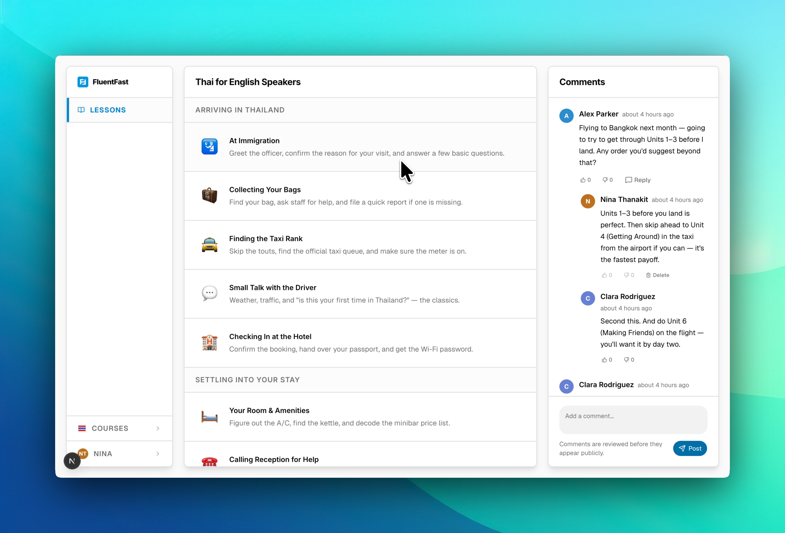
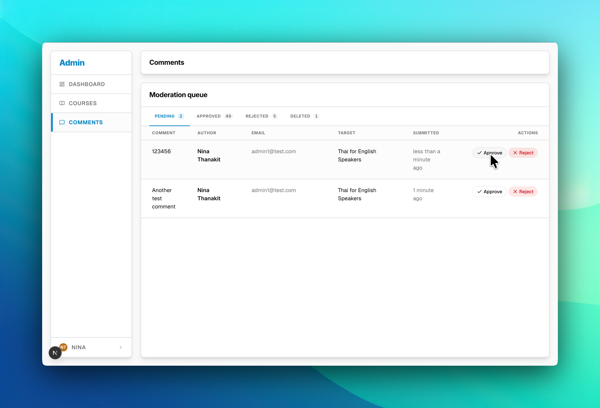
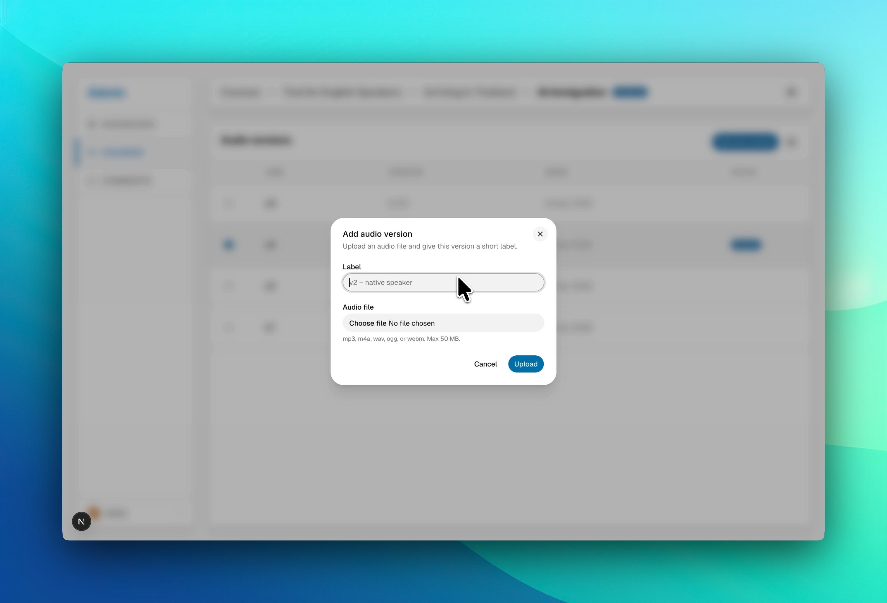

# Fluent Fast

> Source available for portfolio review — see [LICENSE](./LICENSE).

A language-learning platform with audio lessons, moderated community comments, and an admin surface for curating courses. Learners enroll in language pairs (e.g. English → Spanish), work through unit-structured lessons with versioned audio, and discuss each lesson in a comment thread that admins moderate.


## Highlights

- **Audio lesson player** with versioning: lessons carry labeled, duration-tracked audio rows that can be soft-disabled without losing history.
- **Comment moderation pipeline**: every comment flows through a `pending → approved / rejected` state machine, with reactions and an admin dashboard for reviewing the queue.
- **Three-tier auth model**: `requireUser` → `requireUserWithProfile` → `requireAdmin` guards layered over Supabase Auth + Postgres RLS. See [`lib/auth/guards.ts`](./lib/auth/guards.ts).
- **Lazy profile provisioning**: the profile-mirror row in `public.users` is idempotently upserted on first authenticated hit, which handles OAuth logins, admin-created accounts, and any identity that slipped past the email-confirm path.
- **Floating-panel design system**: a small custom layer over shadcn/ui gives the app, admin, and lesson-player shells a consistent panel-based layout across ~90 components.
- **Localized course metadata**: each course tracks `baseLanguage` and `targetLanguage` with country-flag rendering via `react-flagpack`.

## Screenshots

| Course & lessons | Audio player |
|---|---|
|  |  |
| **Admin dashboard** | **Admin audio upload** |
|  |  |

## Tech stack

- **Framework**: Next.js 15 (App Router) + React 19
- **Language**: TypeScript 5
- **Styling**: Tailwind CSS 4
- **Auth**: Supabase Auth (cookie-based SSR via `@supabase/ssr`)
- **Database**: Postgres (Supabase) 
- **ORM + migrations**: Drizzle ORM 0.45 for typed queries, Supabase CLI for migrations
- **Monitoring**: Sentry
- **Validation**: Zod 4
- **Deployment**: Vercel + Supabase (local dev works fully offline via `supabase start`)

## Architecture

Server-side domain logic lives under [`lib/domains/<domain>/`](./lib/domains) and is split into four stable roles:

- `validation/` — Zod schemas for inputs and shared DTOs
- `queries/` — read-only Drizzle queries, split by caller (`public` vs. `admin`)
- `actions/` — Next.js Server Actions that mutate, call guards, and revalidate
- `service.ts` — reusable domain primitives that don't depend on a request context

The three current domains are `comments/`, `courses/`, and `users/`. 

The auth-aware proxy in [`proxy.ts`](./proxy.ts) redirects `/` based on session state (→ `/courses` when signed in, → `/login` otherwise) before any page handler runs.

## Running locally

Requires Node 20+, the Supabase CLI, and Docker (for local Supabase).

1. **Install dependencies**

   ```bash
   yarn install
   ```

2. **Configure environment**

   Copy `.env.example` to `.env.local` and fill in the values. For fully local dev, the Supabase CLI prints the local URL and anon key after `yarn db:start`.

3. **Start Supabase locally**

   ```bash
   yarn db:start      # boots Postgres + Auth + Storage in Docker
   yarn db:reset      # applies migrations + seeds test users
   ```

   Seeded accounts — **local seed only**, never used in any deployed environment (password `Password123` for all): `admin1@test.com`, `user1@test.com` … `user5@test.com`. See [`supabase/seed.sql`](./supabase/seed.sql).

4. **Run the dev server**

   ```bash
   yarn dev
   ```

   App runs on [localhost:3000](http://localhost:3000).

### Useful scripts

| Command | What it does |
|---|---|
| `yarn dev` | Next.js dev server |
| `yarn build` | Production build |
| `yarn lint` | ESLint across the repo |
| `yarn db:start` / `db:stop` | Boot / shut down local Supabase |
| `yarn db:reset` | Reset local DB, run all migrations, apply seed |
| `yarn db:generate` | Generate a Drizzle migration from schema changes |
| `yarn db:studio` | Open Drizzle Studio against the local DB |

---

© 2026 Fred Jones. All rights reserved. Source-available for portfolio review; no license granted for reuse or redistribution.
